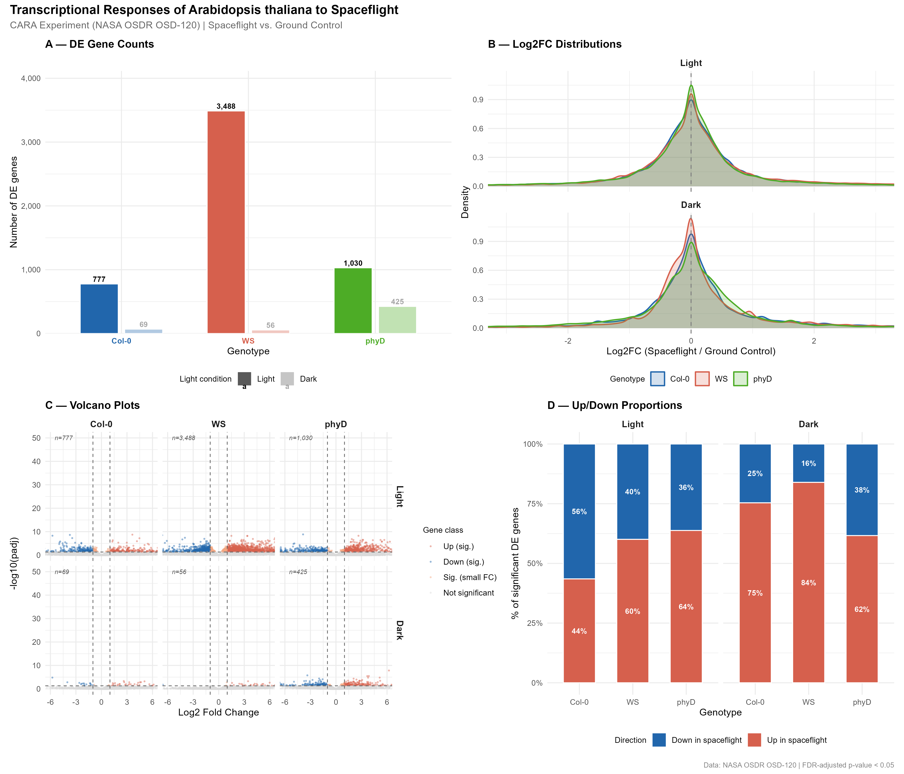
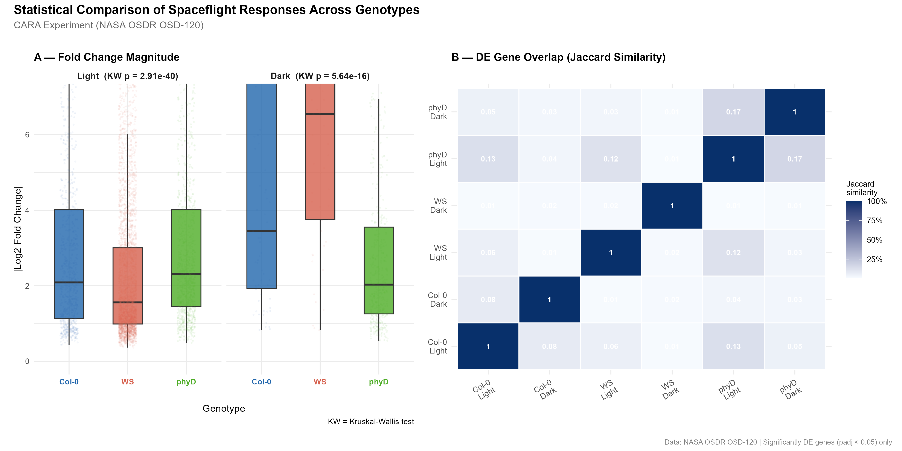

# Genotype- and Light-Dependent Transcriptional Responses of *Arabidopsis thaliana* to Spaceflight

**Author:** Kathryn E. Pagano  
**Course:** BIO539/DSP539   
**Date:** April 2026 

---

## Introduction

As human spaceflight missions extend beyond low Earth orbit, understanding how plants respond to spaceflights environment becomes increasingly important for developing food source systems in space. *Arabidopsis thaliana* has emerged as a key model organism for spaceflight plant biology due to its compact and fully sequenced genome, rapid growth cycle, and extensive genetic resources. The spaceflight environment presents plants with a unique combination of stressors including microgravity, altered radiation exposure, and modified atmospheric conditions, all of which can affect gene expression.

The CARA (Characterizing Arabidopsis Root Attraction) experiment flew three *Arabidopsis* genotypes aboard the International Space Station (ISS), and compared their transcriptional profiles to ground controls. The three genotypes examined were the wild-type Columbia (Col-0) and Wassilewskija (WS) ecotypes, and a loss-of-function mutant in the PHYTOCHROME D gene (phyD) in the Col-0 background. Phytochrome D is a red/far-red light photoreceptor, making the phyD mutant attractive for examining light-dependent responses in spaceflight. Plants were grown under both light and dark conditions, producing six experimental groups.

This analysis addresses if different *Arabidopsis* genotypes display different transcriptional responses to spaceflight microgravity, and if light environment modulate the magnitude or direction of these differences?

---

## Methods

Differential expression data were obtained from the NASA Open Science Data Repository (OSDR), study OSD-120. Pre-processed RNA-seq differential expression tables generated by NASA GeneLab's bulk RNA-seq pipeline were used, specifically the ribosomal RNA-removed version (`rRNArm`) to minimize noise from ribosomal transcripts. The dataset contains log2 fold change values, raw p-values, and FDR-adjusted p-values (padj) for 24,725 *Arabidopsis* genes across all pairwise group comparisons.

All analyses were performed in R Studio, using the tidyverse package suite. Data were filtered to retain only the six biologically relevant contrasts: spaceflight (FLT) versus ground control (GC) within each genotype and light condition combination. Genes with padj < 0.05 were considered significantly differentially expressed (DE).

Three statistical comparisons were conducted. First, Fisher's exact tests were used to compare the proportion of significantly DE genes between genotype pairs within each light condition. Second, Kruskal-Wallis tests were applied to compare absolute log2 fold change magnitudes across genotypes among significantly DE genes, followed by pairwise Wilcoxon tests with Bonferroni correction. Third, chi-square tests were used to assess whether the proportion of up- versus down-regulated genes differed across genotypes. Gene set overlap between groups was quantified using the Jaccard similarity index.

---

## Results

### Genotypes differ markedly in the number of DE genes in spaceflight

The number of significantly DE genes varied substantially across genotypes and light conditions (Figure 1A). Under light conditions, WS showed the strongest transcriptional response with 3,488 DE genes (14.1% of all genes), followed by phyD with 1,030 DE genes (4.2%) and Col-0 with 777 DE genes (3.1%). Under dark conditions, the overall response was considerably weaker across all genotypes: phyD had 425 DE genes (1.7%), Col-0 had 69 (0.3%), and WS had only 56 (0.2%).

Fisher's exact tests confirmed that all pairwise genotype comparisons were statistically significant under light conditions (all p < 2.32e-9), with WS showing a 3.50-fold greater odds of DE gene detection compared to phyD (p = 5.58e-318). Under dark conditions, the Col-0 versus WS comparison was not significant (p = 0.028), while all other pairs remained significant.

### Fold change magnitude differs across genotypes

Despite WS having the most DE genes under light conditions, its median absolute log2 fold change among significant genes was lower (median = 1.56) compared to Col-0 (median = 2.09) and phyD (median = 2.31) (Figure 2A). This pattern suggests that WS exhibits a broad but moderate transcriptional response, while Col-0 and phyD show fewer but more dramatically altered genes. Kruskal-Wallis tests confirmed that fold change magnitudes differed significantly across genotypes in both light (H = 182, p = 2.91e-40) and dark (H = 70.2, p = 5.64e-16) conditions.

Under dark conditions, this pattern reversed: Col-0 showed the highest median absolute fold change (3.45) compared to WS (6.55) and phyD (2.03), though all pairwise differences remained significant after Bonferroni correction.

### Light condition modulates the direction of spaceflight response

Among significantly DE genes, the proportion of genes up- versus down-regulated in spaceflight differed markedly between light conditions (Figure 1D). Under dark conditions, the majority of DE genes were up-regulated in spaceflight across all genotypes (Col-0: 75%, WS: 84%, phyD: 62%). Under light conditions, this pattern shifted: Col-0 showed more down-regulation (56% down), while WS and phyD showed more up-regulation (60% and 64%, respectively). Chi-square tests confirmed that up/down proportions differed significantly across genotypes in both light (χ² = 87.2, df = 2, p = 1.14e-19) and dark (χ² = 14.2, df = 2, p = 8.25e-4) conditions.

**Figure 1.** Overview of transcriptional responses of *Arabidopsis thaliana* genotypes to spaceflight. (A) WS showed the greatest number of significantly differentially expressed (DE) genes under light conditions (3,488), far exceeding Col-0 (777) and phyD (1,030). Dark conditions suppressed the response across all genotypes. (B) Log2 fold change distributions are centered near zero for all genotypes, with WS showing slightly broader tails under dark conditions. (C) Volcano plots confirm that light conditions produce substantially more significant gene expression changes than dark conditions across all genotypes. (D) Under dark conditions, the majority of DE genes are upregulated in spaceflight across all genotypes (62–84%), while under light conditions Col-0 shows a shift toward downregulation (56% down).

### DE gene sets show minimal overlap across groups

Jaccard similarity analysis revealed that the sets of significantly DE genes were largely distinct across groups, with pairwise similarities ranging from 0.03 to 0.17 (Figure 2B). The highest similarity was observed between phyD Light and phyD Dark (Jaccard = 0.17), suggesting that the phyD genotype maintains a more consistent core response across light conditions than the other genotypes. Overall, the low overlap indicates that each genotype and light condition activates a largely unique transcriptional program in response to spaceflight.

**Figure 2.** Statistical comparisons of spaceflight transcriptional responses across *Arabidopsis* genotypes. (A) Despite having the most DE genes, WS shows the smallest median absolute fold change under light conditions (median = 1.56), suggesting a broad but moderate response, while Col-0 (2.09) and phyD (2.31) show fewer but more dramatically altered genes. Kruskal-Wallis tests confirm significant differences in fold change magnitude across genotypes in both light (p = 2.91e-40) and dark (p = 5.64e-16) conditions. (B) Jaccard similarity analysis reveals minimal overlap between DE gene sets across groups (maximum similarity = 0.17), indicating that each genotype and light condition activates a largely unique transcriptional program in response to spaceflight.

---

## Discussion

This analysis demonstrates that *Arabidopsis* genotypes differ substantially in both the scale and nature of their transcriptional responses to spaceflight. WS mounted the largest response under light conditions in terms of gene count, but with smaller individual fold changes, while Col-0 and phyD showed fewer but more dramatically altered genes. The *phyD* mutation, which disrupts red/far-red light perception, produced a notably stronger response under dark conditions compared to the wild-type Col-0 background, raising the possibility that phytochrome-mediated signaling intersects with spaceflight stress pathways even in the absence of light.

The finding that dark conditions broadly suppress the number of DE genes while shifting the direction of response toward up-regulation suggests that light availability fundamentally reshapes how plants integrate spaceflight stress signals. This has practical implications for the design of plant growth systems in future space missions, where lighting regimes may significantly influence plant health and productivity.

A key limitation of this analysis is that it relies on pre-processed differential expression statistics rather than raw count data, precluding re-normalization or alternative statistical modeling approaches. Future work should examine the functional identity of the DE genes, particularly those shared across genotypes, to identify core spaceflight-responsive pathways.

---

## References

Paul, A.L., Zupanska, A.K., Schultz, E.R., and Ferl, R.J. (2013). Organ-specific remodeling of the *Arabidopsis* transcriptome in response to spaceflight. *BMC Plant Biology*, 13, 112. https://doi.org/10.1186/1471-2229-13-112

NASA Open Science Data Repository. OSD-120: CARA — Characterizing Arabidopsis Root Attraction. https://osdr.nasa.gov/bio/repo/data/studies/OSD-120
